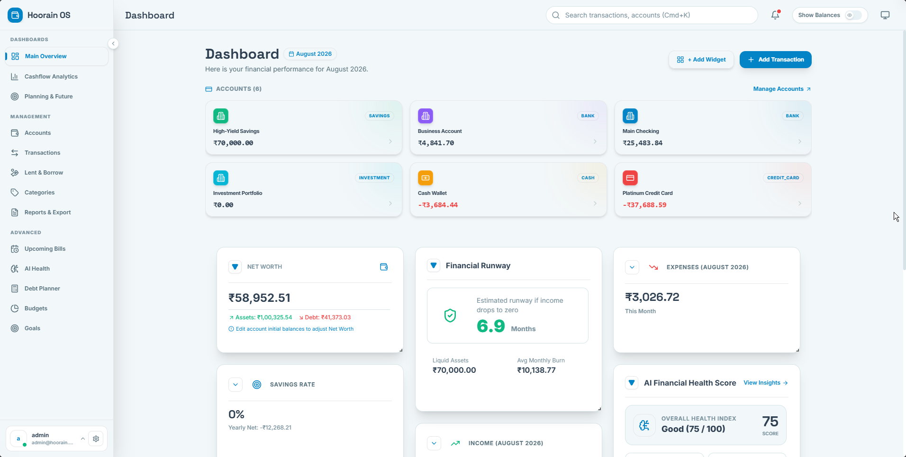
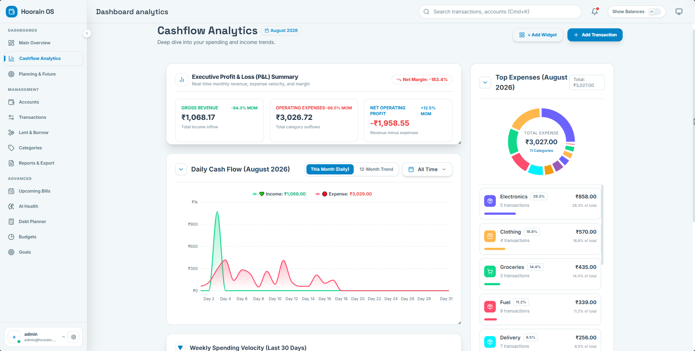
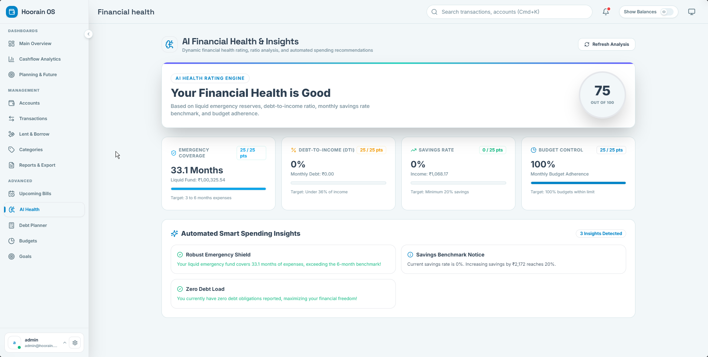
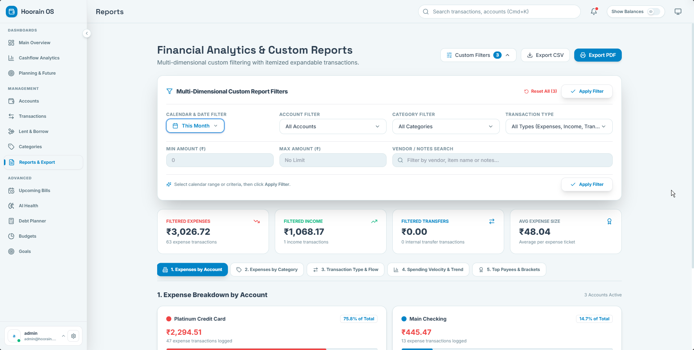
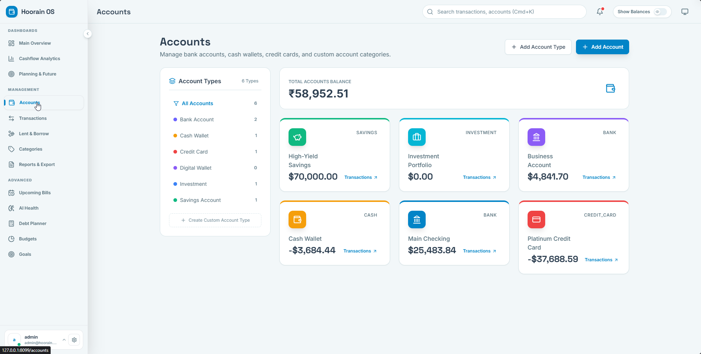
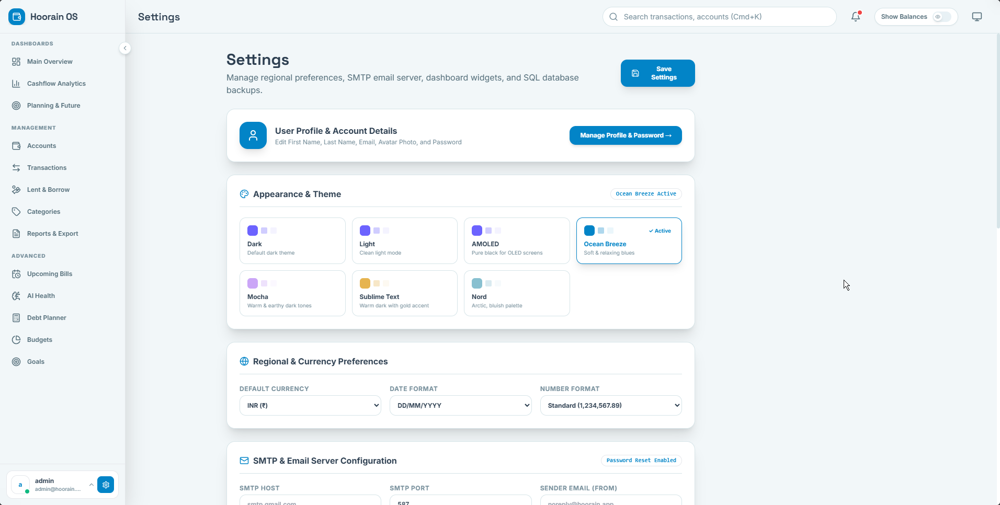

# 💎 Hoorain OS

<div align="center">
 
**A self-hosted, open-source personal finance platform**  
_Track everything. Own your data. Never pay a subscription._

[](https://github.com/meibraransari/hoorain-os.git)


</div>

---

## 📸 Screenshots

| | | |
|---|---|---|
|  |  |  |
|  |  |  |

---

## 🚀 Quick Start

Get **Hoorain OS** running locally in just a few commands:

```bash
git clone https://github.com/meibraransari/hoorain-os.git
cd hoorain-os
docker compose up -d
```

## 🔑 First-Time Admin Setup & Login

When you launch **Hoorain** for the first time via `docker compose up -d`, an initial administrator account is automatically generated during backend startup by the `AdminSeederService` ([admin.seeder.ts](file:///./finance-platform/backend/src/database/seeders/admin.seeder.ts)):

### 🤖 How Admin Creation Works on Startup:
1. **Startup Check**: Upon NestJS container boot, `AdminSeederService.seed()` checks if an administrator record with `username = 'admin'` exists in PostgreSQL.
2. **Automatic Creation**: If no admin is found, it automatically creates the default administrator account using a bcrypt-hashed password and logs the setup banner to container stdout:
   ```
   ╔══════════════════════════════════════╗
   ║     Hoorain — First Boot Setup       ║
   ╠══════════════════════════════════════╣
   ║  Admin Account Created               ║
   ║  Username: admin                     ║
   ║  Password: AdminPass123!             ║
   ╚══════════════════════════════════════╝
   ```
3. **Default Credentials**:
   - **URL:** `127.0.0.1:080`
   - **Username:** `admin`
   - **Email:** `admin@hoorain.app`
   - **Default Password:** `AdminPass123!`
   - **Role:** `ADMIN`

> ⚠️ **Security Tip:** After logging in for the first time at `http://127.0.0.1:8080`, navigate to **Profile** or **Settings** to update your admin password.

### Creating Additional Admin Users
You can create new users or secondary administrator accounts via the API:

```bash
# 1. Obtain Auth Token as default Admin
TOKEN=$(curl -s -X POST http://127.0.0.1:8080/api/v1/auth/login \
  -H "Content-Type: application/json" \
  -d '{"username":"admin","password":"AdminPass123!"}' \
  | python3 -c "import sys,json; print(json.load(sys.stdin)['accessToken'])")

# 2. Register a new Administrator
curl -X POST http://127.0.0.1:8080/api/v1/users \
  -H "Authorization: Bearer $TOKEN" \
  -H "Content-Type: application/json" \
  -d '{
    "username": "hoorain_admin",
    "email": "admin2@hoorain.app",
    "password": "YourSecurePassword123!",
    "role": "ADMIN"
  }'
```

---

## 🚀 Quick Start

**5 commands to get Hoorain running:**

```bash
# 1. Clone the repo
git clone https://github.com/meibraransari/hoorain-os.git && cd hoorain

# 2. Configure environment
cp .env.example .env

# 3. Start all services
docker compose up -d

# 4. Wait for healthy state (~30 seconds)
docker compose ps

# 5. Open the app in your browser
open http://127.0.0.1:8080
```

> **Default port:** `8080` — configurable via `APP_PORT` in `.env`

---

## 🐳 Docker Setup

### Development

```bash
# Start all services in background
docker compose up -d

# View logs
docker compose logs -f

# Stop everything
docker compose down

# Rebuild after code changes
docker compose up -d --build backend frontend
```

### Production (with SSL)

```bash
# Copy production compose file
docker compose -f docker-compose.prod.yml up -d

# View production logs
docker compose -f docker-compose.prod.yml logs -f nginx backend
```

See [docs/DEPLOYMENT.md](docs/DEPLOYMENT.md) for full SSL + Cloudflare setup.

---

## ⚙️ Environment Variables

| Variable | Default | Required | Description |
|---|---|---|---|
| `APP_PORT` | `8080` | No | External HTTP port for Nginx |
| `APP_PORT_SSL` | `443` | No | External HTTPS port for Nginx (Prod only) |
| `FRONTEND_PORT` | `3000` | No | External host port mapped to Frontend (Next.js) |
| `BACKEND_PORT` | `3001` | No | External host port mapped to Backend (NestJS) |
| `POSTGRES_PORT` | `5432` | No | External host port mapped to PostgreSQL |
| `REDIS_PORT` | `6379` | No | External host port mapped to Redis |
| `NODE_ENV` | `production` | No | `production` or `development` |
| `POSTGRES_USER` | `hoorainos` | No | Database username |
| `POSTGRES_PASSWORD` | — | **Yes** | Database password (change!) |
| `POSTGRES_DB` | `hoorainos` | No | Database name |
| `REDIS_PASSWORD` | — | **Yes** | Redis password (change!) |
| `DATABASE_HOST` | `postgres` | No | Internal Docker DNS host for Postgres database |
| `REDIS_HOST` | `redis` | No | Internal Docker DNS host for Redis cache |
| `BACKEND_HOST` | `backend` | No | Internal Docker DNS host for Backend container |
| `JWT_SECRET` | — | **Yes** | Access token secret (64+ chars) |
| `JWT_REFRESH_SECRET` | — | **Yes** | Refresh token secret (64+ chars) |
| `JWT_EXPIRY` | `15m` | No | Access token lifetime |
| `JWT_REFRESH_EXPIRY` | `30d` | No | Refresh token lifetime |
| `DATA_FOLDER` | `./data` | No | Persistent storage root |
| `BACKUP_PATH` | `./backups` | No | Backup output directory |
| `MAX_UPLOAD_SIZE` | `50mb` | No | Max file upload size |
| `BACKUP_RETAIN_DAYS` | `30` | No | Days to keep old backups |
| `DOMAIN` | — | Prod | Your domain name for SSL |
| `SSL_CERT_PATH` | `./ssl` | Prod | Path to Let's Encrypt certs |
| `NEXT_PUBLIC_API_URL` | `/api` | No | Frontend API base URL |

> 🔐 **Security note:** Generate strong secrets with:
> ```bash
> openssl rand -hex 64
> ```

## 🧠 AI Financial Health Score & Smart Insights

Hoorain features an intelligent **AI Financial Health Score (0-100)** engine (`/financial-health`) evaluating four core financial metrics:

1. **Emergency Fund Coverage**: $\text{Liquid Savings} / \text{Average Monthly Expenses}$ (Target: 3–6 months).
2. **Debt-to-Income Ratio (DTI)**: $\text{Monthly Debt Payments} / \text{Monthly Income}$ (Target: $< 36\%$).
3. **Savings Rate Benchmark**: $\text{Net Monthly Savings} / \text{Monthly Income}$ (Target: $\ge 20\%$).
4. **Budget Adherence Score**: Percentage of monthly budgets maintained within limit.

Automated smart spending insights alert you of category spending spikes, emergency coverage status, and debt paydown advice.

---

## 📉 Debt Payoff & Amortization Planner (Snowball vs. Avalanche)

An interactive payoff planner (`/debt-planner`) for credit cards, home loans, car loans, and personal debts offering two strategies:

- **Debt Avalanche ⚡**: Targets highest interest rate (APR) debts first to minimize total interest paid.
- **Debt Snowball ❄️**: Targets smallest balance debts first for quick psychological wins.

Includes estimated debt-free target dates, interest savings projections, extra monthly payment simulators, and month-by-month amortization schedule tables.

---

## 🤝 Lent & Borrow (Debts & Loans Management)

Hoorain includes a dedicated **Lent & Borrow** module (`/lent-borrow`) designed for tracking money given out to contacts and money borrowed from people:

- **Money Lent (Receivable)**: Saved as a transaction (`type = 'expense'`, `category = 'Lent'`) for your chosen account (e.g. Savings), automatically decreasing cash balance and adding to total receivables (`+₹XX,XXX`).
- **Money Borrowed (Payable)**: Saved as a transaction (`type = 'income'`, `category = 'Borrowed'`) for your chosen account (e.g. Savings), automatically increasing account cash balance and adding to total payables (`-₹XX,XXX`).
- **Settlement & Repayment**: Marking a record as **Settled** toggles `excludeFromBalance` and marks loan as fully repaid.

---

## ⚡ Real-Time Account Balance Calculation

Account balances are mathematically calculated and synchronized in real time via database triggers and dynamic service aggregation:

$$\text{Current Balance} = \text{Initial Balance} + \sum (\text{Active Income}) - \sum (\text{Active Expenses})$$

- **PostgreSQL Database Trigger**: `trg_sync_account_balance` automatically updates `accounts.current_balance` on every `INSERT`, `UPDATE`, or `DELETE` transaction.
- **Dynamic Re-calculation**: `AccountsService.findAll()` evaluates total non-excluded transactions for 100% mathematical precision across all bank, cash, and credit accounts.

---

## 📤 Import Database & Mobile App Data

Hoorain can import your existing data from mobile finance apps and database backups (.sql / .sqlite / .json).

### Step 1 — Export Data
1. Open your mobile finance app or backup settings
2. Choose **JSON / SQLite / SQL** format
3. Save the export file

### Step 2 — Import to Hoorain
```bash
# Get your auth token first
TOKEN=$(curl -s -X POST http://127.0.0.1:8080/api/v1/auth/login \
  -H "Content-Type: application/json" \
  -d '{"username":"admin","password":"yourpassword"}' \
  | python3 -c "import sys,json; print(json.load(sys.stdin)['accessToken'])")

# Run the import script
./scripts/import-cashew.sh /path/to/database_export.json "$TOKEN"
```

### Step 3 — Check Import Status
```bash
curl -s -H "Authorization: Bearer $TOKEN" \
  http://127.0.0.1:8080/api/v1/import/cashew/{importId} | python3 -m json.tool
```

See [docs/DATABASE.md](docs/DATABASE.md) for the full field mapping table.

---

## 💾 Backup & Restore

### Create a Backup
```bash
# Backs up database + uploads
./scripts/backup.sh

# Custom output directory
./scripts/backup.sh /mnt/external/HoorainOS-backups

# Or use Make
make backup
```

### Restore from Backup
```bash
# Restores database (creates safety backup first, requires confirmation)
./scripts/restore.sh ./backups/db_20240901_120000.sql.gz

# Or use Make
make restore FILE=./backups/db_20240901_120000.sql.gz
```

### Automated Backups (Production)
The `pgbackup` service in `docker-compose.prod.yml` runs daily backups automatically and prunes backups older than `BACKUP_RETAIN_DAYS` (default: 30 days).

---

## 📖 API Documentation

Full interactive API docs are available at:

```
http://127.0.0.1:8080/api/docs
```

(Swagger UI with try-it-out support)

For a static reference, see [docs/API.md](docs/API.md).

---

## ⬆️ Upgrading

```bash
# 1. Pull latest changes
git pull origin main

# 2. Rebuild images
```bash
# 1. Build and tag images locally
docker compose build

# 2. Push production images to Docker Hub repository (ibraransaridocker)
docker compose push

# 3. Apply any new migrations
docker compose exec backend npm run migration:run

# 4. Restart with new images
docker compose up -d

# 5. Verify container health
docker compose ps
```

### 🐳 Docker Hub Pre-Built Images:
- **Backend:** `ibraransaridocker/hoorain-backend:latest`
- **Frontend:** `ibraransaridocker/hoorain-frontend:latest`

> Always back up before upgrading: `make backup`

---

## 🤝 Contributing

Contributions are welcome! Please:

1. Fork the repository
2. Create a feature branch: `git checkout -b feat/my-feature`
3. Commit your changes: `git commit -m 'feat: add my feature'`
4. Push to the branch: `git push origin feat/my-feature`
5. Open a Pull Request

Please follow [Conventional Commits](https://www.conventionalcommits.org/) and ensure TypeScript compiles without errors.

---

## 🗺 Roadmap

- [ ] Mobile-responsive PWA
- [ ] Plaid / Open Banking integration
- [ ] AI-powered transaction categorization
- [ ] Multi-user household sharing
- [ ] Email/webhook notifications
- [ ] CSV import from any bank
- [ ] Dark mode
- [ ] Annual tax report export

---

## 📄 License

GNU AGPLv3 License — see [LICENSE](LICENSE) for details.

---

<div align="center">

Made with ❤️ for the self-hosting community

**[Feature Guide](docs/FEATURES.md) · [API Reference](docs/API.md) · [Database Schema](docs/DATABASE.md) · [Deployment Guide](docs/DEPLOYMENT.md)**

</div>
